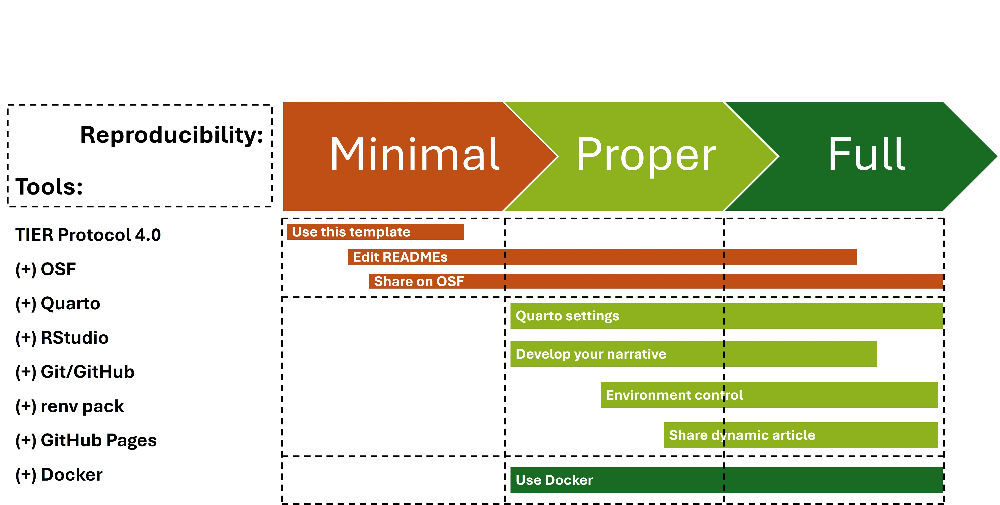

# ARTE: Article Reproducibility Template & Envorinment

[](https://bar.anpad.org.br/index.php/bar/article/view/722) [](https://www.projecttier.org/tier-protocol/protocol-4-0/) [](https://phdpablo.github.io/article-template/) [](https://osf.io/njdq5/) [](https://doi.org/10.5281/zenodo.17057679) [](https://creativecommons.org/licenses/by-nc/4.0/) [](https://www.r-project.org/) [](https://quarto.org/) [](https://www.docker.com/) [](https://rstudio.github.io/renv/)

This repository provides a template for creating a **dynamic and fully reproducible research article** using **Quarto**, **RStudio**, the **TIER Protocol 4.0**, and **Docker**. It offers a structured project organization, integrates seamlessly with Git/GitHub for version control, and is configured for easy publication on **GitHub Pages** and **OSF**.

The template is designed to meet the **Full Reproducibility** standard by encapsulating the entire computational environment, including R, R packages (managed by `renv`), and LaTeX dependencies, within a Docker container. This ensures that your research can be replicated exactly, regardless of the user's local machine setup.

The image below provides a summary of the repository's folder structure. There is a `README.md` file including an Overview, Contents, Guidelines, and Additional Resources in every TIER 4.0 Protocol folder. Its deployment, which acts as a showcase, provides more details: <https://phdpablo.github.io/article-template/>.


Prior to beginning this guide, you should also review the script shown in the accompanying figure, which is easier to understand after reading the following: <https://phdpablo.github.io/article-template/02-background.html>



## Table of Contents

-   [Features](#features)
-   [Prerequisites](#prerequisites)
-   [Quick Start (Using Docker - Recommended)](#quick-start-using-docker---recommended)
-   [Setup, Build, and Run (Detailed Docker Steps)](#setup-build-and-run-detailed-docker-steps)
-   [Accessing the RStudio Environment](#accessing-the-rstudio-environment)
-   [Daily Workflow](#daily-workflow)
-   [Environment Features](#environment-features)
-   [Useful Commands](#useful-commands)
-   [Troubleshooting](#troubleshooting)
-   [Publishing Your Article](#publishing-your-article)
-   [Important Notes](#important-notes)
-   [Citation](#citation)
-   [License](#license)

## Features

-   **TIER Protocol 4.0 Structure:** Organized folder structure (`Data/`, `Scripts/`, `Output/`) aligned with the [TIER Protocol](https://www.projecttier.org/tier-protocol/protocol-4-0/) for clear reproducibility.
-   **Quarto Book Project:** Utilizes [Quarto's powerful book format](https://quarto.org/docs/books/) for creating rich, dynamic documents integrating text, code (R), and outputs.
-   **RStudio Integration:** Pre-configured for use within the [RStudio IDE](https://posit.co/download/rstudio-desktop/).
-   **Version Control Ready:** Integrated with [Git/GitHub](https://git-scm.com/) for tracking changes.
-   **Environment Control (Full Reproducibility):** Uses [**Docker**](https://www.docker.com/) to containerize the entire computational environment (R 4.5.1, RStudio, Quarto, LaTeX) and [**renv**](https://rstudio.github.io/renv/) for precise R package management.
-   **Persistent Data & Settings:** Project files, installed R packages, and RStudio configurations persist between container sessions.
-   **Automated Cleanup:** Includes a script (`render_cleanup.R`) to tidy up temporary files after rendering.
-   **Easy Deployment:** Configured for publication on GitHub Pages (gh-page branch) via GitHub Actions (`.github/workflows/deploy.yml`).
-   **Sharing Platform:** Designed for sharing on the [Open Science Framework (OSF)](https://osf.io/).

## Prerequisites

Before using this template for **Full Reproducibility**, ensure you have the following installed on your machine:

1.  **Git (Optional):** For cloning the repository and version control. [Download Git](https://git-scm.com/downloads)
2.  **Docker:** For creating and running the reproducible environment. [Download Docker Desktop](https://docs.docker.com/get-docker/) and ensure it is running.

> **Note for Users with Lower Computational Literacy:** This template aims to simplify the process. The core requirement is having Docker installed and running. The provided scripts handle the rest.

## Quick Start

This method uses the pre-configured Docker setup for the easiest and most reproducible experience.

1.  **Get the Template:**
    -   **Use as Template (Recommended):** Click the green "Use this template" button on the GitHub repository page, name your new repository, and choose its visibility (Public/Private).
    -   **Clone:** `git clone https://github.com/your-username/your-repo-name.git`
    -   **Download ZIP:** If you don't have Git installed, click the green "Code" button and select "Download ZIP". Extract the folder.
2.  **Navigate to the Docker Directory:**
    -   Open your terminal (Command Prompt, PowerShell, Terminal)
        -   Change directory (`cd`) into the `docker` folder of your cloned/downloaded project: `cd path/to/your/project/docker`
    -   Or open the `docker` folder in your file explorer.
3.  **Start the Environment:**
    -   **Windows:** Double-click `start.bat`.
    -   **macOS/Linux:** Run `./start.sh` (you might need `chmod +x start.sh` first).
    -   This script automatically finds an available port, builds the Docker image (if needed), starts a container with the name of the folder you cloned/downloaded, and opens RStudio in your browser.
4.  **Access RStudio:**
    -   Your browser should automatically open RStudio at `http://127.0.0.x:8787`. If not, go to your browser.
    -   You are logged in automatically as the `rstudio` user.
    -   Your project files are located in `/home/rstudio/project`.
5.  **Start Working:**
    -   Open `article-template.Rproj`. Rename it to your project name if you wish.
    -   Navigate to and open the Quarto files (e.g., `index.qmd`, `01-intro.qmd`).
    -   Edit, run code chunks, and render your project using `quarto render` in the RStudio Terminal. You can also use the Render button in RStudio.
6.  **Stop the Environment:**
    -   When finished:
        -   **Windows:** Double-click `stop.bat`.
        -   **macOS/Linux:** Run `./stop.sh`.

## Setup, Build, and Run (Detailed Docker Steps)

If you prefer manual control or want to understand the process:

1.  **Navigate:** Open a terminal and `cd` into the `docker` directory of your project.
2.  **(Optional) Build the Image:**
    -   If you want to explicitly build the image first: `docker-compose build`
3.  **Run the Container:**
    -   Start the container in detached mode: `docker-compose up -d`
    -   The `docker-compose.yml` file handles port mapping, volume mounting for persistence, and setting environment variables.
4.  **Stop the Container:**
    -   To stop and remove the container: `docker-compose down`

## Accessing the RStudio Environment

-   **URL:** `http://127.0.0.x:8787` (The `start` scripts automatically open this).
-   **Authentication:** No login required (`DISABLE_AUTH=true`).
-   **User:** You are logged in as the `rstudio` user.
-   **Project Location (in Container):** `/home/rstudio/project` (This is your local project folder mounted inside the container).

## Daily Workflow

1.  **Start:** Use `docker/start.bat` or `docker/start.sh`.
2.  **Work in RStudio:**
    -   Open `article-template.Rproj` or `.Rproj` file that you renamed.
    -   Edit `.qmd` files.
    -   Run R code chunks directly in the `.qmd` files or in the R console.
    -   Install new R packages using `install.packages()`. `renv` will track them.
    -   Use `renv::snapshot()` to update `renv.lock` when you add new packages.
    -   Use `quarto render` in the Terminal to build your outputs (HTML, PDF).
3.  **Stop:** Use `docker/stop.bat` or `docker/stop.sh` when done.

## Environment Features

-   **Base Image:** `rocker/verse:4.5.1` (Includes R, RStudio Server, Quarto, Pandoc, TinyTeX).
-   **R Package Management:** `renv` is pre-configured.
    -   **Library Path:** `/renv/library` (Mounted as a Docker volume for persistence).
    -   **Cache Path:** `/renv/cache` (Mounted as a Docker volume for faster reinstalls and sharing between projects).
    -   **Packages:** Core packages defined in `renv.lock` are restored during the Docker image build for the first render.
-   **LaTeX/TinyTeX:** Essential LaTeX packages (`amsfonts`, `unicode-math`, `booktabs`, `caption`, `float`) are pre-installed in the Docker image.
-   **Data Persistence:** Your project directory (`..` relative to `docker/`) is mounted to `/home/rstudio/project`.
-   **RStudio Settings Persistence:** RStudio configuration (`.config`, `.local`, `.rstudio`, `.R`) is stored in `docker/cache/` and mounted into the container, preserving your layout and preferences per project.
-   **Port Management:** The `start` scripts automatically find an open port starting from `127.0.0.1:8787`.

## Useful Commands

-   **Inside RStudio Terminal:**
    -   `quarto render`: Render the entire book/project.
    -   `quarto render report.qmd`: Render a specific file.
    -   `source("render_cleanup.R")`: Run the post-render cleanup script.
-   **In your Host Terminal (inside `docker/` directory):**
    -   `docker-compose up -d`: Start the container.
    -   `docker-compose down`: Stop and remove the container.
    -   `docker-compose build`: Rebuild the Docker image.
    -   `docker-compose logs`: View container logs.
    -   `docker volume ls`: List Docker volumes (to see `renv_cache`, `renv_library`).
    -   `docker volume prune`: Remove unused Docker volumes (use with caution).

## Troubleshooting

-   **Docker not running:** Ensure the Docker Desktop application (or Docker daemon on Linux) is started.
-   **Port in use:** The `start` scripts automatically find the next available port. Check the terminal output for the URL.
-   **Permission denied (Linux/macOS):** Make the scripts executable: `chmod +x docker/start.sh docker/stop.sh`.
-   **Container fails to start:**
    -   Check Docker logs: `cd docker && docker-compose logs`.
    -   Ensure the `docker` directory is your current working directory when running `docker-compose` commands.
-   **Packages not found after restart:** Ensure `renv` is activated (opening `article-template.Rproj` usually does this) and run `renv::restore()` if needed.
-   **RStudio settings not persisting:** Ensure the `docker/cache` directory exists and has the correct permissions.

## Publishing Your Article

This template is configured for easy publication on GitHub Pages using GitHub Actions.

1.  **Ensure GitHub Pages Source is Set:**
    -   Go to your repository on GitHub.
    -   Navigate to **Settings** \> **Pages**.
    -   Under **Build and deployment**, set **Source** to "Deploy from a branch".
    -   Select **Branch:** `gh-pages` and **Path:** `/ (root)`.
    -   Click **Save**.
2.  **Render Your Site:**
    -   In RStudio (within the Docker container), run `quarto render`. This generates the HTML files into the `docs/` directory.
3.  **Commit and Push:**
    -   Commit your changes (including the updated `docs/` folder and potentially `renv.lock` if you added packages) locally.
    -   Push the changes to the `main` branch of your GitHub repository.
4.  **Trigger Deployment:**
    -   The workflow defined in `.github/workflows/deploy.yml` automatically runs on pushes to `main`.
    -   It builds the site and pushes the contents of `docs/` to the `gh-pages` branch.
5.  **View Your Site:**
    -   After the workflow completes successfully, your site will be available at `https://<your-github-username>.github.io/<your-repo-name>/`.

## Important Notes

-   **Project Structure:** The main narrative files (`.qmd`) and configuration (`_quarto.yml`, `references.bib`, etc.) are in the **root** of the repository. Docker mounts this root directory to `/home/rstudio/project` inside the container.
-   **Docker Context:** The `docker-compose.yml` uses `..` (the project root) as the build context, allowing the Dockerfile to access files like `renv.lock`.
-   **renv:** This template relies heavily on `renv` for reproducibility. Familiarize yourself with its basic usage (`snapshot`, `restore`).
-   **Git Integration:** While the Docker environment provides isolation, you should still use Git locally on your host machine for version control of your project files.
-   **Administrative Files:** The `Adm/` folder is intended for administrative files and is ignored by Git (via `.gitignore`) and not published to GitHub Pages.

## Citation

If you use this template, please cite it as:

Rogers, P., & Limongi, R. (2025). Open Science in Three Acts: Foundations, Practice, and Implementation - Third Act. *BAR - Brazilian Administration Review*, *22*(3),e250162. <https://doi.org/10.1590/1807-7692bar2025250162>

**BibTex:**

``` r
@article{rogers2025,
  title = {Open Science in Three Acts: Foundations, Practice, and Implementation - Third Act},
  author = {Rogers, Pablo and Limongi, Ricardo},
  year = {2025},
  journal = {BAR - Brazilian Administration Review},
  volume = {22},
  number = {3},
  pages = {e250162},
  issn = {1807-7692},
  doi = {10.1590/1807-7692bar2025250162},
}
```

We also recommend reading:

Limongi, R., & Rogers, P. (2025). Open Science in Three Acts: Foundations, Practice, and Implementation - Second Act. *BAR - Brazilian Administration Review*, *22*(2), e250116. <https://doi.org/10.1590/1807-7692bar2025250116>

Limongi, R., & Rogers, P. (2025). Open Science in Three Acts: Foundations, Practice, and Implementation - First Act. *BAR - Brazilian Administration Review*, *22*(1), e250079. <https://doi.org/10.1590/1807-7692bar2025250079>

## License

This project is licensed under the Creative Commons Attribution-NonCommercial 4.0 International License - see the [LICENSE](LICENSE) file for details.
